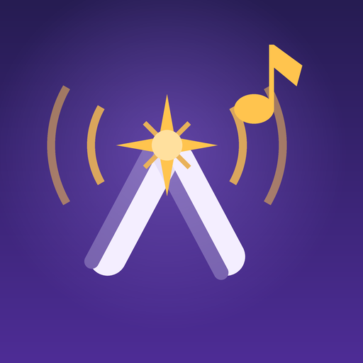
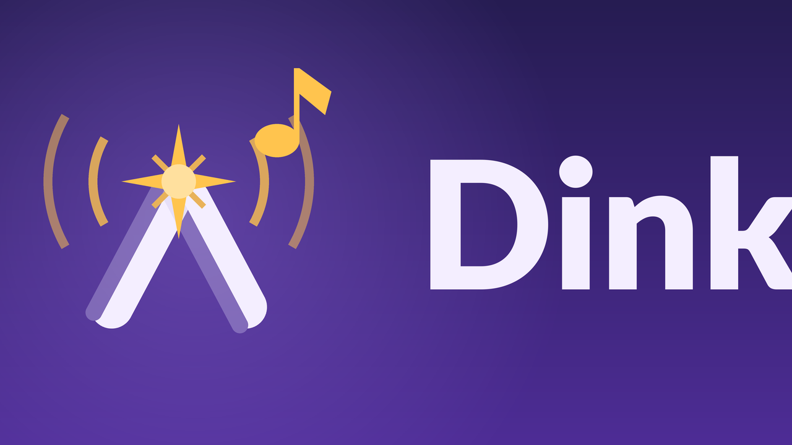

<div align="center">



# Dink — Network Music Player for Android TV

Play the music you already own — from network shares, USB drives, and local storage — on
the big screen, with a remote-friendly interface built for the TV, not a phone shrunk to fit.



</div>

---

## What it is

Dink is a music player for the living room. Point it at your collection — on a NAS, a USB
drive, or the device itself — and play it on the TV with fast D-pad navigation. No account,
no sign-up, no ads, no tracking. Your files stream; they are never uploaded, copied, or
shared.

## Features

**Sources**
- **SMB / network shares** — browse and stream straight from your NAS or PC, no copying to
  the device. LAN auto-discovery finds shares for you; credentials are stored encrypted and
  reconnect on restart.
- **USB drives and SD cards** — plug in and Dink picks up the music automatically.
- **On-device storage.**

**Library**
- Organised by Songs, Albums, Artists, Playlists, and Folders.
- Accurate metadata read from embedded ID3 / Vorbis / MP4 tags (not just filenames).
- Cover art from embedded artwork.
- Instant search and Shuffle All.
- Import per-folder and Monitor per-share — Dink re-scans monitored sources in the
  background as your collection grows.

**Playback**
- Media3 / ExoPlayer engine: queue, shuffle, repeat, gapless.
- Now-playing screen with cover art.
- Windowed engine queue so shuffle-all over a whole library can't ANR.

**Lyrics**
- Synced (karaoke-style) and plain lyrics from embedded tags, `.lrc` sidecar files, or a
  range of online providers (LRCLIB, NetEase, QQ, Musixmatch, and more). Turn individual
  sources on or off in Settings.

**Sound**
- Built-in multi-band equalizer with presets plus a full graphic EQ.

**Private by design**
- No account, no sign-up, no ads, no tracking.
- Network credentials stay encrypted on the device and never leave it.

## Requirements

- Android TV, Android 12 (API 31) or newer.
- `applicationId`: `com.dink.player`.

## Building

Native WSL/Linux build. Debug build + deploy to a connected device:

```bash
./gradlew assembleDebug
adb install -r -t app/build/outputs/apk/debug/app-debug.apk
```

Release artifacts (AAB for Play upload + APK for sideload):

```bash
./release.sh both
```

See **[RELEASE.md](RELEASE.md)** for the full Play Store release process (keystore,
signing, Console setup) and **[PHASES.md](PHASES.md)** for the build plan of record.

## Tech

- Kotlin + Jetpack Compose for TV (`androidx.tv.material3`).
- Media3 / ExoPlayer playback with a `MediaSessionService`.
- smbj for SMB; `android.media.audiofx.Equalizer` for the EQ.
- AGP built-in Kotlin toolchain (AGP 9).

## License

All rights reserved. Personal project — not currently open for redistribution.
